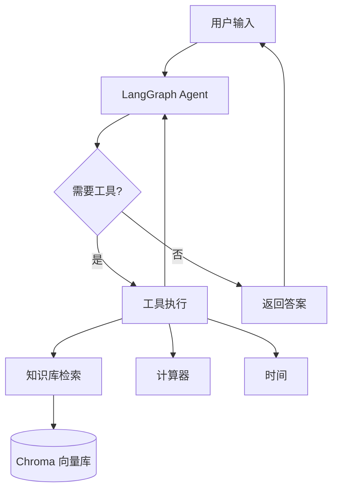

# 架构图

```mermaid
graph TB
    User[用户输入] --> Agent[LangGraph Agent]
    Agent --> Decision{需要工具?}
    Decision -->|是| Tools[工具执行]
    Decision -->|否| End[返回答案]
    Tools --> RAG[知识库检索]
    Tools --> Calc[计算器]
    Tools --> Time[时间]
    RAG --> Chroma[(Chroma 向量库)]
    Tools --> Agent
    End --> User
```
