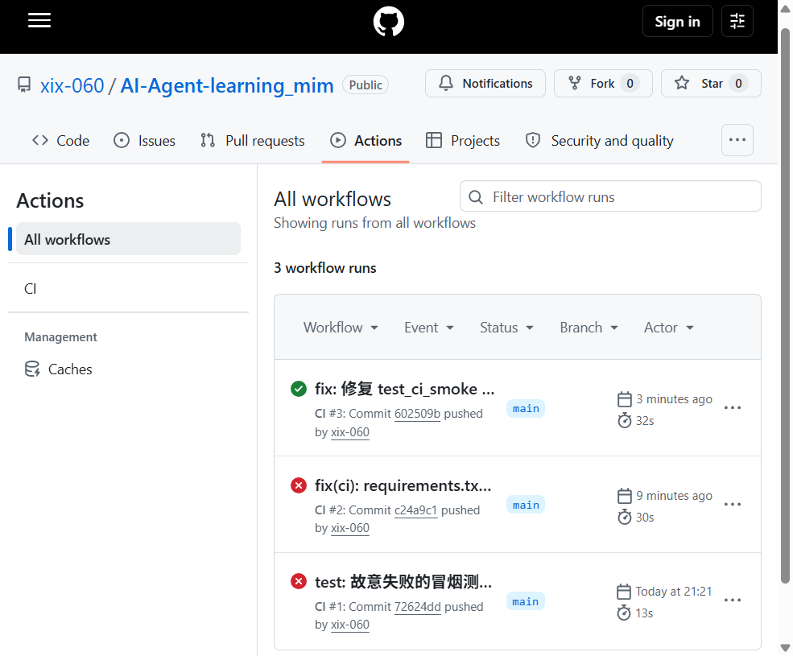
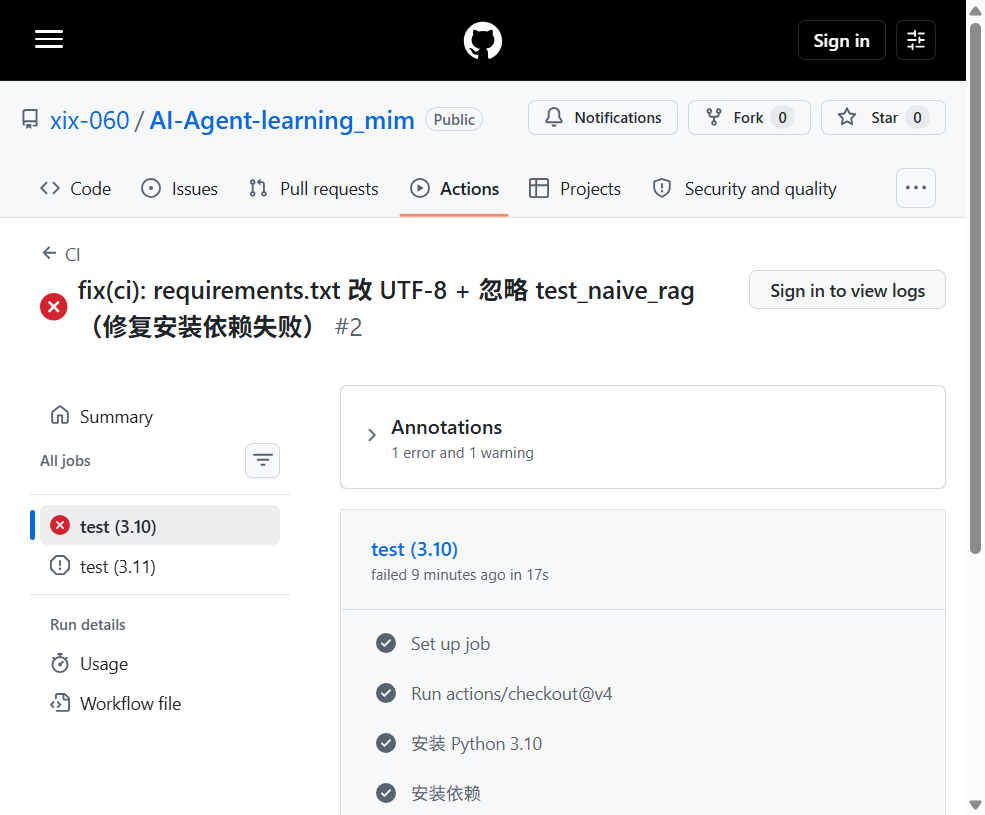
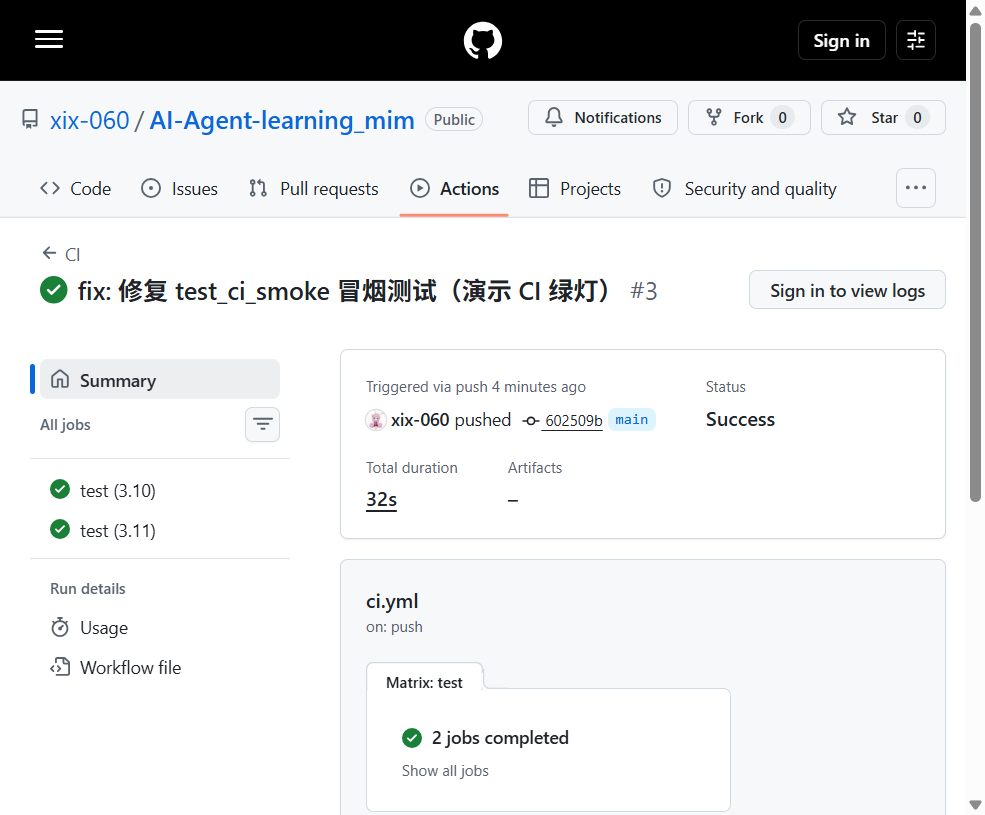
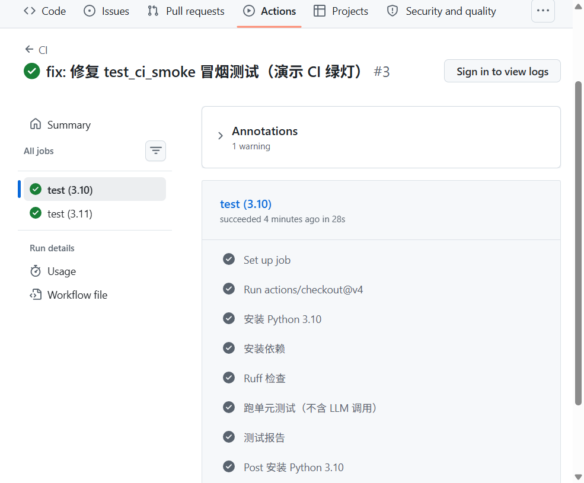

# CI/CD 基础

## CI（持续集成）

push 代码 → 自动跑   检查/测试 → 失败就拦截

价值：AI 写的代码再也不能"看起来能跑"，CI 是铁面验收官

## CD（持续交付/部署）

测试通过 → 自动部署（本周只做 CI，部署在项目阶段做）

## 我们的工具链

| 环节        | 工具             | 触发                     |
| :-------- | :------------- | :--------------------- |
| 代码检查      | ruff           | pre-commit（本地）+ CI（远端） |
| 格式化       | ruff format    | pre-commit             |
| 单元测试      | pytest         | CI                     |
| Python 版本 | 3.10 & 3.11 矩阵 | CI                     |

## 为什么 AI Coding 时代 CI 更重要

AI 生成代码快 → 人工 review 速度跟不上 → 必须机器验收
（呼应昨天的结论：LLM 自评不可靠，CI 是客观裁判）

## 实战：红灯 → 绿灯演示（2026-08-26）

流程：故意写必挂测试 → push → 看红灯 → 修复 → push → 看绿灯。

仓库：`https://github.com/xix-060/AI-Agent-learning_mim`

### 三次 push 的耗时与结果

| 序号 | commit                                    | push 时间        | run 耗时 | 结果 |
| :-- | :---------------------------------------- | :------------- | :------ | :--- |
| #1  | `72624dd` test: 故意失败的冒烟测试（演示 CI 红灯）  | 21:20:23 +0800 | 13s     | 红灯 |
| #2  | `c24a9c1` fix(ci): requirements.txt 改 UTF-8 | 21:30:33 +0800 | 30s     | 红灯 |
| #3  | `602509b` fix: 修复 test_ci_smoke 冒烟测试    | 22:43:24 +0800 | 32s     | 绿灯 |

> run 耗时 = GitHub Actions 从触发到结束的总时长；从 push 到看到结果，再加 1~3s 的 webhook/调度延迟。

### 红灯（Run #2）

Run #1 因 `requirements.txt` 是 UTF-16 编码，Linux 上 `pip install` 解析失败 → 安装依赖 step 直接挂。
Run #2 修了编码、也 `--ignore=tests/test_naive_rag.py` 跳过缺依赖的测试，但 `test_ci_smoke` 仍是必挂的 `assert 1 + 1 == 3`，于是挂在「跑单元测试（不含 LLM 调用）」step。

红灯列表页：

红灯失败 step 详情（test (3.10) job，总耗时 17s）：

### 绿灯（Run #3）

把 `test_ci_smoke` 的断言改回 `1 + 1 == 2`，本地先 `pre-commit run --all-files` + `pytest -m "not llm"` 全过再 push，远端绿灯。

绿灯列表页：

绿灯 step 详情（test (3.10) job，总耗时 28s，全绿）：

### 复盘要点

- **本地模拟远端**：push 前一定要 `pre-commit run --all-files && pytest -m "not llm" --ignore=tests/test_chat_local.py --ignore=tests/test_naive_rag.py` 本地全过，远端基本就稳。
- **红灯不是坏事**：红灯 = CI 在帮你拦 bug；怕的是本地绿、远端红（环境差异，如本例的 UTF-16 编码问题）。
- **从 push 到出结果约 30s 级**：本次 run 都在 13~32s 内出结果，CI 反馈足够快，可以放心「小步快跑、频繁 push」。
- **环境差异是头号红灯杀手**：Windows 默认 UTF-16、`numpy/pdfplumber` 未进 requirements、`gh` 不在 PATH 等本地看不到的问题，只有远端 Ubuntu 才会暴露。
