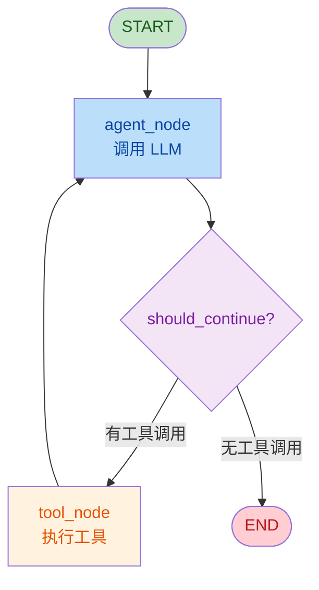

# LangGraph 核心概念

## 1. 什么是 LangGraph？

LangChain 团队推出的 Agent 编排框架，基于**状态机**理念。
适合需要复杂流程控制的 Agent：多步推理、人机协同、可暂停/可恢复。

## 2. 三大核心概念

### 节点（Node）

每个节点是一个函数，接收状态，返回更新后的状态。
   

类比：流程图里的每个方框。

### 边（Edge）

节点之间的连接，分两种：

- 普通边：A → B（固定流转）
- 条件边：A → B or C（根据状态决定去哪）

### 状态（State）

在节点间传递的数据，用 TypedDict 定义。
       

类比：流水线上传送的产品。

## 3. LangGraph vs 手写 Agent

| 维度   | 手写 ReAct（第4周） | LangGraph       |
| :--- | :------------ | :-------------- |
| 流程控制 | while 循环      | 状态机图            |
| 可暂停  | ❌             | ✅（Checkpointer） |
| 可恢复  | ❌             | ✅               |
| 人机协同 | ❌             | ✅（interrupt）    |
| 可视化  | ❌             | ✅（Mermaid 图）    |
| 调试   | print         | LangSmith 追踪    |

## 4. 最简 LangGraph 示例

### 流程图



### 完整代码（可运行）

```python
# pip install langgraph langchain-core

from typing import Literal
from langchain_core.messages import AIMessage, HumanMessage, SystemMessage
from langchain_core.tools import tool
from langgraph.graph import StateGraph, START, END, MessagesState
from langgraph.prebuilt import ToolNode

# ========== 1. 定义工具 ==========
@tool
def calculator(expr: str) -> float:
    """计算数学表达式，如 '2 + 3 * 4'"""
    return eval(expr)

@tool
def get_time() -> str:
    """获取当前时间"""
    from datetime import datetime
    return datetime.now().strftime("%Y-%m-%d %H:%M:%S")

tools = [calculator, get_time]
tool_node = ToolNode(tools)

# ========== 2. 定义节点函数 ==========
def agent_node(state: MessagesState) -> dict:
    """调用 LLM，决定是否用工具"""
    messages = state["messages"]

    # 构建 prompt（用你自己的 LLM 客户端）
    system_prompt = SystemMessage(
        content="你是智能助手，可以调用工具：calculator 计算，get_time 查时间。"
    )

    # 这里替换成你的 LLM 调用
    # response = your_llm.invoke([system_prompt] + messages)

    # 模拟 LLM 响应（演示用，实际应从 LLM 获取）
    response = AIMessage(content="")
    response.tool_calls = [{"name": "calculator", "args": {"expr": "2 + 3 * 4"}}]

    return {"messages": [response]}

# ========== 3. 定义条件边 ==========
def should_continue(state: MessagesState) -> Literal["tools", END]:
    """检查是否需要继续调用工具"""
    last_message = state["messages"][-1]
    if last_message.tool_calls:
        return "tools"  # 去执行工具
    return END  # 结束

# ========== 4. 构建图 ==========
workflow = StateGraph(MessagesState)

# 添加节点
workflow.add_node("agent", agent_node)
workflow.add_node("tools", tool_node)

# 添加边
workflow.add_edge(START, "agent")                    # 入口
workflow.add_conditional_edges("agent", should_continue)  # 条件分支
workflow.add_edge("tools", "agent")                  # 工具执行完回 agent

# 编译
app = workflow.compile()

# ========== 5. 运行 ==========
result = app.invoke({
    "messages": [HumanMessage(content="计算 2 + 3 * 4")]
})
print(result["messages"][-1].content)
```

### 关键概念解析

| 概念 | 代码对应 | 说明 |
|------|----------|------|
| **State** | `MessagesState` | 节点间传递的数据结构 |
| **Node** | `agent_node`, `tool_node` | 接收 state，返回更新 |
| **Edge** | `add_edge()`, `add_conditional_edges()` | 控制流转 |
| **START** | `add_edge(START, "agent")` | 入口节点 |
| **END** | `return END` | 终止条件 |

### 与手写 ReAct 对比

```python
# ===== 手写 ReAct =====
while True:
    response = llm.generate(prompt)
    if "Final Answer:" in response:
        break
    result = execute_tool(response)
    prompt += result

# ===== LangGraph =====
# 声明式定义，自动循环
workflow.add_node("agent", agent_node)
workflow.add_node("tools", tool_node)
workflow.add_edge("tools", "agent")  # 自动循环
```

## 5. 为什么用 LangGraph？

- 生产级 Agent 需要可控制流（不能死循环）
- 需要人机协同（Agent 遇到关键决策问人）
- 需要持久化（Agent 可暂停后恢复）
- LangGraph 是目前最成熟的 Agent 编排框架
