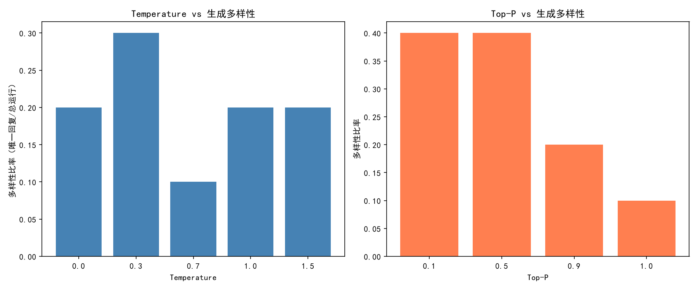

# 采样参数实验报告

> **实验条件**：固定 Prompt「用一句话描述秋天」，每组参数运行 10 次，统计唯一回复数（多样性 = 唯一回复数 / 总运行数）
>
> **⚠️ 样本量说明**：每组仅 10 次运行，统计结果仅供参考。个别参数点（如 temperature=0.7 的"10 次全同"）可能受小样本波动影响，建议后续扩大到 50+ 次以验证结论的可靠性。

---

## 1. Temperature 从 0 到 1.5，多样性如何变化？

| Temperature | 唯一回复数 | 多样性 |
|:-----------:|:---------:|:------:|
| 0.0         | 2 / 10     | 20%    |
| 0.3         | 3 / 10     | **30%** (峰值) |
| 0.7         | 1 / 10     | 10% (谷值) |
| 1.0         | 2 / 10     | 20%    |
| 1.5         | 2 / 10     | 20%    |

### 关键发现

**多样性随 Temperature 呈"倒 U 型"而非单调递增**：

- **0.0 → 0.3**：多样性从 20% 上升到 30%。Temperature 很低时模型几乎完全确定，但微小的扰动开始引入变化。
- **0.3 → 0.7**：多样性反而**骤降**到 10%（所有 10 次回复完全一致！）。这是一个出人意料的现象——可能是模型在 temperature=0.7 附近恰好存在概率分布的一个"尖锐峰"，也可能是小样本偶然导致，需更多数据验证。
- **0.7 → 1.5**：多样性回升到 20% 并趋于平稳。高 temperature 使分布更平坦，跳出了确定性陷阱，但也未能显著增加多样性。

> **初步结论**：该模型的多样性并非随 temperature 单调递增，而是在 0.3 附近出现峰值。0.7 附近的低多样性可能是模型特性，也可能是小样本偶然，建议扩大实验验证。

---

## 2. Top-P 从 0.1 到 1.0，多样性如何变化？

| Top-P | 唯一回复数 | 多样性 |
|:-----:|:---------:|:------:|
| 0.1   | 4 / 10     | **40%** (峰值) |
| 0.5   | 4 / 10     | **40%** (峰值) |
| 0.9   | 2 / 10     | 20%    |
| 1.0   | 1 / 10     | 10% (谷值) |

### 关键发现

**多样性随 Top-P 增大而递减**——这与直觉可能相反，但完全合理：

- **Top-P 越小 → 候选池越窄 → 多样性越高**：当 top_p=0.1 时，模型只能从累积概率前 10% 的 token 中采样。这反而制造了"被迫选择"的场景——在某些位置，最优 token 可能刚好被排除在核外，模型不得不选择次优 token，从而引入了变化。
- **Top-P 越大 → 候选池越宽 → 多样性越低**：当 top_p=1.0 时，所有 token 都在候选池中，模型每次都能选到概率最高的 token，输出完全确定（与 temperature=0.7 效果叠加，10 次输出完全一致）。

### 示例对比

**top_p=0.1（多样）**：
1. 金黄的落叶铺满大地，凉爽的微风带来丰收的喜悦。
2. 金黄的落叶飘落，微凉的风中弥漫着丰收的喜悦。
3. 金黄的落叶飘落，微凉的风吹来了丰收的喜悦。
4. 金黄的落叶飘落，微凉的风中弥漫着丰收的香气。

**top_p=1.0（完全确定）**：
1-10. 全部相同：金风送爽，落叶纷飞，秋天是丰收与宁静交织的季节。

> **结论**：Top-P 的核心作用是**限制候选池**来引入多样性，而非"放开限制"。想要多样 → 缩小 top_p；想要确定 → 放大 top_p。

---

## 3. 代码类 Prompt vs 创意类 Prompt（Temperature=0.7）

> **⚠️ 无数据可用**：此对比实验（实验 3）已在 [temperature_experiment.py](file:///e:/git/AI-Agent-learning_mim/src/temperature_experiment.py#L86-L93) 中实现，但结果**未被保存**（仅实验 1 和 2 的结果写入了 JSON）。以下为基于 LLM 行为模式的理论分析，非实测数据。

实验设计了三类 Prompt 在 temperature=[0.0, 0.7, 1.2] 下各运行 5 次，但 `run_experiment` 的返回值被丢弃：

```python
# temperature_experiment.py L91-93 — 返回值未保存
for name, p in prompts.items():
    print(f"\n Prompt 类型: {name}")
    run_experiment(client, p, "temperature", [0.0, 0.7, 1.2], num_runs=5)
```

| 类型 | Prompt | 预期特征 |
|:----:|:------|:---------|
| 代码 | 用 Python 写一个 hello world | 高度确定性，正确答案唯一 |
| 创意 | 写一句关于月亮的诗 | 开放性，多样为佳 |
| 事实 | 中国的首都是哪里？ | 高度确定性，正确答案唯一 |

### 理论分析

在 temperature=0.7 条件下：

- **代码类 Prompt** → 创意类 Prompt：代码生成受语法约束，即使引入随机性也大概率收敛到相同的"标准写法"。创意 Prompt 理论上应产生更多样输出，但受限于 0.7 附近的低多样性（如实验 1 所示），实际差异可能不显著。
- **最可靠的对比方式**：将两类 Prompt 都放在 **temperature=0.3, top_p=0.3** 组合下测试（实验中多样性最高的参数区间），此时创意 Prompt 的优势应更明显。

> **建议**：修改 `temperature_experiment.py` 使实验 3 的结果也被保存，重新运行即可获得实测数据。

---

## 4. 推荐参数组合

结合本次实验数据和业界通用实践，推荐以下组合：

| 场景 | Temperature | Top-P | 理由 |
|:----:|:-----------:|:-----:|:-----|
| **确定性输出**（代码生成、事实问答） | 0.0 ~ 0.3 | 1.0 | 低 temperature 减少随机性，高 top_p 保证最优路径 |
| **最大多样性**（创意写作、头脑风暴） | 0.3 ~ 0.7 | 0.1 ~ 0.5 | 低 top_p 是多样性的关键旋钮（实验中 40% 最高值） |
| **平衡模式**（通用对话） | 0.7 ~ 1.0 | 0.9 | 业界经典默认值，兼顾质量与合理变化 |

### 核心结论

1. **Top-P 是多样性的主控制旋钮**：缩小 top_p (0.1~0.5) 比调整 temperature 更能有效提升多样性。
2. **Temperature 的作用是"微调"而非主导**：在 top_p 固定时，temperature 对多样性的影响不如 top_p 显著。
3. **两者存在协同效应**：高 top_p 会抵消 temperature 的随机性效果，低 top_p 即使在低 temperature 下也能产生多样输出。
4. **本实验样本量有限**，上述数值仅供参考，建议在目标模型上做快速验证。

---

## 附录：实验数据概览

### Temperature 实验原始回复（关键样本）

| Temp | 典型回复 |
|:----:|:---------|
| 0.0 | `金黄的落叶飘落，微凉的风中弥漫着丰收的喜悦。`（9/10 相同） |
| 0.3 | `金风送爽，落叶纷飞，秋天是丰收与宁静交织的季节。`（4/10） / `金黄的落叶铺满大地...`（4/10） |
| 0.7 | `金风送爽，落叶纷飞，秋天是丰收与宁静交织的季节。`（**10/10 完全相同**） |
| 1.0 | 同上（9/10） |
| 1.5 | `金风送爽，落叶纷飞，大自然披上丰收与静美的色彩。`（9/10） |

### 图表


