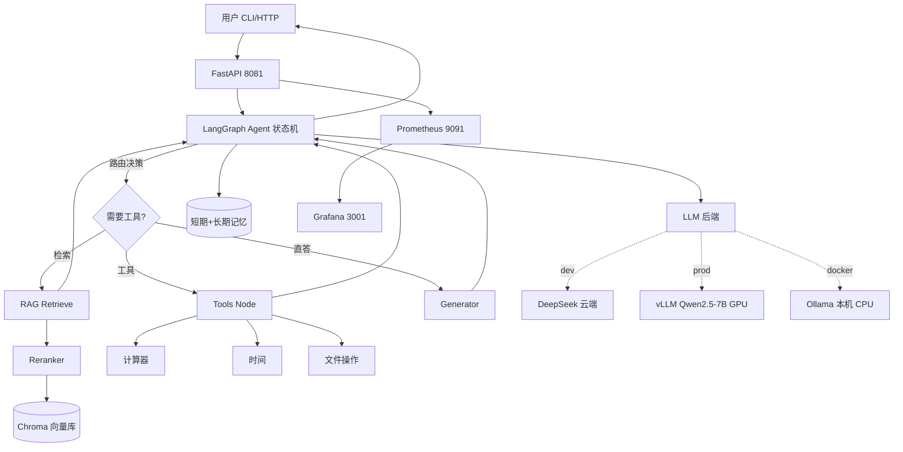

# 🧠 个人知识库 Agent（Personal Knowledge Agent）

> 基于 LangGraph + RAG 的智能知识库助手，支持多源文档导入、跨源检索、工具调用、可观测部署。
>
> **技术栈**：LangGraph · Chroma · Qwen3/DeepSeek · FastAPI · vLLM · Prometheus/Grafana

## ✨ 核心亮点

- 🔄 LangGraph 状态机编排（可暂停 / 可恢复 / 人机协同）
- 📄 多源文档导入：PDF / TXT / Markdown / 网页
- 🔍 跨源 RAG 检索：向量检索 + Reranker
- 🛠 工具调用：计算器 / 时间 / 文件操作
- 💬 多轮对话：短期记忆 + 跨会话长期记忆
- 📊 RAGAS 评估 + Locust 性能压测 + Agent 任务评测
- 🚀 Docker + Prometheus/Grafana 一键可观测部署

## 🏗 架构



> 节点说明：Agent 节点做意图识别与决策；Router 判断是否检索；RAG 走 Chroma 向量检索 + Reranker 重排；Tools 走 LangGraph `ToolNode` 统一执行；Generator 整合上下文与工具结果生成最终回答。详细组件说明见 [docs/architecture.md](file:///e:/git/AI-Agent-learning_mim/knowledge_agent/docs/architecture.md)。

## 📊 量化指标（实测）

| 指标 | 值 | 口径 / 来源 |
|---|---|---|
| RAGAS faithfulness | **1.00** | 早期 RAG 模块 5 题手动评测，[docs/rag-eval-manual.json](file:///e:/git/AI-Agent-learning_mim/docs/rag-eval-manual.json) |
| Agent 任务成功率 | **80%（8/10）** | 时间/计算/文件/多步/推理五类，[docs/agent-eval-report.json](file:///e:/git/AI-Agent-learning_mim/docs/agent-eval-report.json) |
| 部署 QPS @ P99<1s | **0（CPU 后端）** | 本机 Ollama qwen2.5:0.5b，P99 落在 60~120s 档；GPU+vLLM 待回填，[DEPLOY.md](file:///e:/git/AI-Agent-learning_mim/knowledge_agent/DEPLOY.md) |
| /chat 平均延迟 | 56.7s（3 次实测） | CPU 后端验证链路正确性，同上 |
| Token 吞吐 | ≈2.0 tokens/s | 337 tokens / 170s |
| 文档检索 Top-3 命中 | context_precision 1.00 | 5 题检索命中口径，同 rag-eval-manual.json |

> 完整评测方法、失分分析与复现命令见 [docs/eval-report.md](file:///e:/git/AI-Agent-learning_mim/knowledge_agent/docs/eval-report.md)。

## 🚀 快速开始

```bash
# 1. 安装依赖
pip install -r requirements.txt

# 2. 配置 API Key
cp .env.example .env   # 编辑 .env

# 3. 导入文档
python main.py import --path ./data/sample.pdf

# 4. 对话
python main.py chat
```

对话中可用命令：`help` / `stats` / `clear` / `quit`。支持 PDF / TXT / Markdown / 网页 URL 导入。

### API 服务

```bash
python api.py
# 或 uvicorn api:app --host 0.0.0.0 --port 8000 --reload
```

| 方法 | 路径 | 说明 |
|---|---|---|
| GET | `/health` | 健康检查 |
| GET | `/` | 服务信息 |
| POST | `/chat` | 对话（一次性返回） |
| POST | `/chat/stream` | 对话（SSE 流式） |
| POST | `/import` | 导入文档（路径或 URL） |
| POST | `/upload` | 上传文档并导入 |

调用示例：`curl -X POST http://localhost:8000/chat -H "Content-Type: application/json" -d '{"message":"你好","session_id":"u1"}'`

## 🐳 部署

一键容器化部署（API + Prometheus + Grafana）：

```bash
cd knowledge_agent/deploy && docker compose up -d --build
curl http://localhost:8081/health
```

- 三环境配置：`.env.dev`（DeepSeek）/ `.env.prod`（vLLM 7B GPU）/ `.env.docker`（Ollama 或宿主 vLLM）
- 监控面板：Grafana `http://localhost:3001`（admin/admin），指标 `ka_requests_total` / `ka_request_latency_seconds` / `ka_llm_tokens_total`
- 完整部署、冒烟测试与端口规划见 [DEPLOY.md](file:///e:/git/AI-Agent-learning_mim/knowledge_agent/DEPLOY.md)

## 📈 评测

```bash
# Agent 任务评测（10 题，关键词命中口径）
python eval.py
```

评测维度与结果汇总见 [docs/eval-report.md](file:///e:/git/AI-Agent-learning_mim/knowledge_agent/docs/eval-report.md)；压测脚本与基线见根目录 [src/loadtest/locustfile.py](file:///e:/git/AI-Agent-learning_mim/src/loadtest/locustfile.py) 与 [DEPLOY.md 性能基线](file:///e:/git/AI-Agent-learning_mim/knowledge_agent/DEPLOY.md#性能基线实测)。

## 🎬 演示视频

- B 站演示：<https://www.bilibili.com/video/BV1Y2um6UEB8/?vd_source=2b0d152e167a850719670c04905ef01e>
- 3-5 分钟录制脚本（知识库导入 → 对话 → 工具调用 → 部署监控截图）：[docs/demo-script.md](file:///e:/git/AI-Agent-learning_mim/knowledge_agent/docs/demo-script.md)

## 🛠 技术栈

| 组件 | 技术 |
|---|---|
| LLM 框架 | LangChain + LangGraph |
| LLM 模型 | Qwen-Turbo（dev）/ DeepSeek-Chat（dev）/ Qwen2.5-7B-Instruct via vLLM（prod） |
| 向量数据库 | ChromaDB |
| 嵌入模型 | text-embedding-v3（DashScope） |
| 重排序模型 | gte-rerank（无 key 自动降级） |
| API 服务 | FastAPI + Uvicorn |
| 监控 | Prometheus + Grafana |
| PDF 解析 | pypdf |
| 网页抓取 | requests + BeautifulSoup |

## 📁 目录结构

```
knowledge_agent/
├── src/
│   ├── agent.py          # LangGraph Agent 主逻辑
│   ├── rag.py            # RAG 检索（多源加载 + Reranker）
│   ├── tools.py          # 工具集（计算器/时间/文件）
│   ├── memory.py         # 记忆管理（短期 + 长期）
│   └── config.py         # 配置管理
├── tests/
├── docs/
│   ├── architecture.md   # 架构文档
│   ├── eval-report.md    # 评测报告
│   └── demo-script.md    # 演示视频脚本
├── deploy/               # Docker Compose + Prometheus/Grafana
├── data/                 # 测试文档 + chroma_db
├── api.py                # FastAPI 入口
├── main.py               # CLI 入口
├── eval.py               # 评测脚本
├── DEPLOY.md             # 部署文档
└── .env.example
```

## 🔮 未来工作

- [ ] GPU + vLLM 回填生产基线，达成 QPS @ P99<1s 容量目标
- [ ] RAGAS 自动化评测接入（faithfulness / answer_relevancy / context_precision）
- [ ] 多模态文档导入（图片 / 扫描件 OCR）
- [ ] 检索召回优化：混合检索（向量 + BM25）+ HyDE
- [ ] 长期记忆检索化（向量检索历史会话）

## 📝 许可证

MIT License，见根目录 [LICENSE](file:///e:/git/AI-Agent-learning_mim/LICENSE)。CI 见 [.github/workflows/ci.yml](file:///e:/git/AI-Agent-learning_mim/.github/workflows/ci.yml)。
