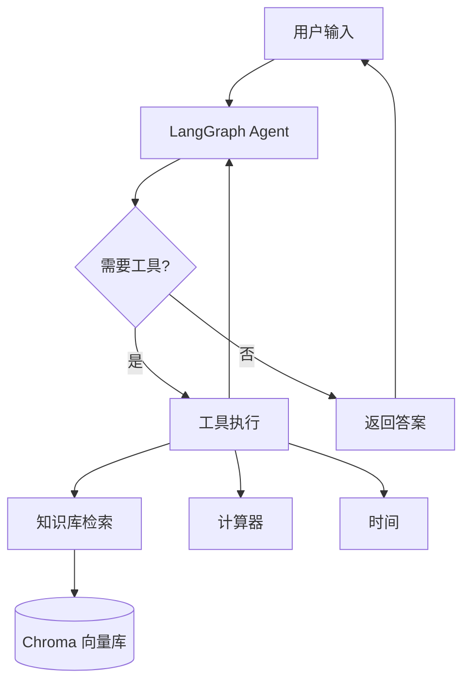

# 知识代理架构

## 系统架构图

```
┌─────────────────────────────────────────────────────────────────────┐
│                           用户界面                                    │
│                    (CLI / API / Web)                                  │
└─────────────────────────────────────────────────────────────────────┘
                                    │
                                    ▼
┌─────────────────────────────────────────────────────────────────────┐
│                         知识代理 (Agent)                              │
│                        [LangGraph StateMachine]                       │
├─────────────────────────────────────────────────────────────────────┤
│                                                                     │
│  ┌─────────────┐    ┌─────────────┐    ┌─────────────┐              │
│  │   Agent     │───▶│   Router    │───▶│  Retriever  │              │
│  │   Node      │    │   Node      │    │   Node      │              │
│  └─────────────┘    └─────────────┘    └─────────────┘              │
│        │                                     │                      │
│        │         ┌─────────────┐             │                      │
│        └────────▶│  Generator  │◀────────────┘                      │
│                  │   Node      │                                     │
│                  └─────────────┘                                     │
│                                                                     │
└─────────────────────────────────────────────────────────────────────┘
           │                        │                        │
           ▼                        ▼                        ▼
┌─────────────────────┐  ┌─────────────────────┐  ┌─────────────────────┐
│      LLM 服务        │  │      RAG 引擎        │  │      工具集          │
│    (Qwen-Turbo)      │  │    (ChromaDB)        │  │   (Tools)           │
├─────────────────────┤  ├─────────────────────┤  ├─────────────────────┤
│ - 文本生成          │  │ - 文档加载          │  │ - list_documents     │
│ - 意图识别          │  │ - 向量嵌入          │  │ - read_document     │
│ - 工具调用          │  │ - 相似度搜索        │  │ - search_knowledge   │
│ - 对话管理          │  │ - 结果排序          │  │ - get_system_info   │
└─────────────────────┘  └─────────────────────┘  │ - calculate         │
                                                    └─────────────────────┘
           │                        │                        │
           └────────────────────────┼────────────────────────┘
                                    │
                                    ▼
┌─────────────────────────────────────────────────────────────────────┐
│                         数据存储层                                    │
├─────────────────────────────────────────────────────────────────────┤
│  ┌─────────────────────┐  ┌─────────────────────┐                   │
│  │   向量数据库         │  │     文件存储          │                   │
│  │   (ChromaDB)        │  │   (uploads/)         │                   │
│  └─────────────────────┘  └─────────────────────┘                   │
│                                                                     │
│  ┌─────────────────────┐  ┌─────────────────────┐                   │
│  │   对话记忆           │  │     配置文件          │                   │
│  │   (Memory)          │  │   (.env)             │                   │
│  └─────────────────────┘  └─────────────────────┘                   │
└─────────────────────────────────────────────────────────────────────┘
```

<br />



## 核心组件说明

### 1. Agent 节点

- **职责**: 理解用户意图，决定处理流程
- **技术**: LangGraph + ChatModel
- **输入**: 用户消息
- **输出**: 处理路径决策

### 2. Router 节点

- **职责**: 判断是否需要知识检索
- **策略**:
  - 基于关键词匹配
  - 基于 LLM 意图识别
  - 基于知识库状态

### 3. Retriever 节点

- **职责**: 从知识库检索相关信息
- **技术**: ChromaDB 向量检索
- **参数**:
  - top\_k: 返回结果数量
  - similarity\_threshold: 相似度阈值

### 4. Generator 节点

- **职责**: 生成最终回答
- **功能**:
  - 整合检索结果
  - 调用工具
  - 格式化输出

## 数据流图

```
用户输入
    │
    ▼
┌─────────┐
│  Agent  │────▶ 意图分析
└─────────┘
    │
    ▼
┌─────────┐     需要检索
│ Router  │──────────────┐
└─────────┘              │
    │                    │
    │ 不需要检索          ▼
    │              ┌─────────────┐
    │              │  Retriever  │
    │              └─────────────┘
    │                    │
    ▼                    ▼
┌─────────────────────────────┐
│         Generator           │
│  (LLM + Tools + Context)    │
└─────────────────────────────┘
    │
    ▼
用户回答
```

## 技术栈

| 组件     | 技术                | 版本    |
| ------ | ----------------- | ----- |
| 语言     | Python            | 3.10+ |
| LLM 框架 | LangChain         | 0.2+  |
| 状态图    | LangGraph         | 0.1+  |
| LLM    | Qwen-Turbo        | -     |
| 向量数据库  | ChromaDB          | 0.5+  |
| 嵌入模型   | text-embedding-v3 | -     |
| 配置管理   | python-dotenv     | 1.0+  |

## 目录结构

```
knowledge_agent/
├── src/                    # 源代码
│   ├── agent.py           # Agent 主逻辑
│   ├── rag.py             # RAG 模块
│   ├── tools.py           # 工具集
│   ├── memory.py          # 记忆管理
│   └── config.py          # 配置
├── tests/                  # 测试
├── docs/                   # 文档
│   └── architecture.md    # 架构文档
├── data/                   # 数据
│   ├── uploads/           # 上传文件
│   └── chroma_db/         # 向量库
├── main.py                 # 入口
└── requirements.txt        # 依赖
```

## 扩展点

### 添加新工具

```python
from langchain_core.tools import tool

@tool
def my_new_tool(param: str) -> str:
    """工具描述"""
    return f"Result: {param}"

# 在 tools.py 中注册
AVAILABLE_TOOLS.append(my_new_tool)
```

### 添加新节点

```python
def custom_node(state: AgentState) -> AgentState:
    """自定义节点"""
    # 处理逻辑
    return state

# 在 _build_graph 中添加
workflow.add_node("custom", custom_node)
```

### 更换 LLM

在 config.py 中修改:

```python
class LLMConfig:
    MODEL = "your-model-name"
```
