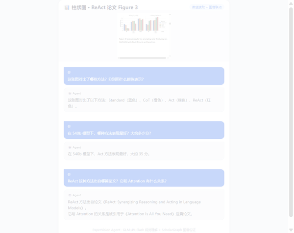
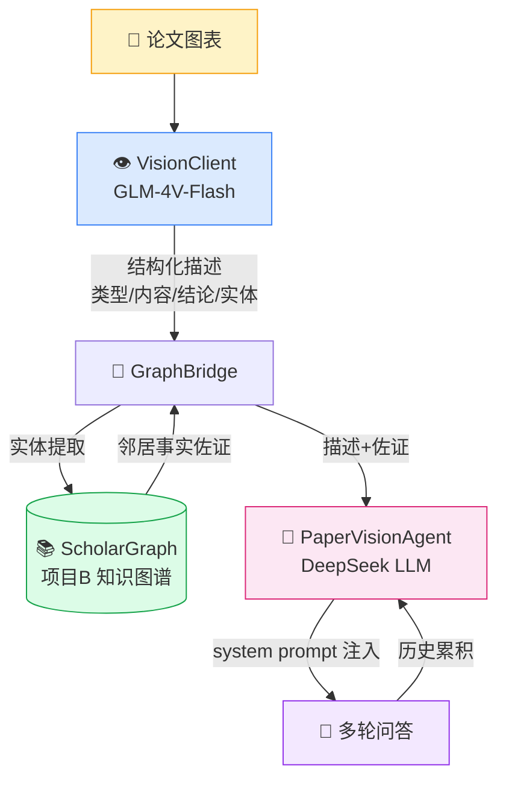

# Paper Vision Agent —— 论文图表多模态问答

> 上传论文图表，AI 读懂图中的数据 / 结构 / 关系，并结合学术知识图谱回答追问。
> 项目 B（scholar_knowledge）的多模态扩展：**让 GraphRAG 不仅能读文字，也能读图**。



> GIF 由真实问答合成，可一键重现：[`run_demo_qa.py`](run_demo_qa.py) 采集 → [`gen_qa_card.py`](gen_qa_card.py) 渲染卡片 → [`make_gif.py`](make_gif.py) 合成

## 核心亮点

- 👁️ **多模态视觉理解**：智谱 GLM-4V-Flash（免费）结构化读图，输出「类型 / 内容 / 结论 / 实体」四段描述
- 🔗 **图谱联动佐证**：从图中实体（如 ReAct、Transformer）反向查 [scholar_knowledge](../scholar_knowledge/README.md) 图谱，补充"该论文引用了谁 / 被谁引用"
- 💬 **多轮对话追问**：历史累积，可基于上一轮答案继续深挖
- 🛡️ **诚实降级**：图谱未命中实体时返回空，不编造；图谱服务不可用时降级为纯视觉问答
- 📊 **三类图实测**：柱状图数值读取（ReAct Figure 3）、架构图结构理解（Attention Figure 1）、表格解析（Attention Table 2）

## 工作流



## 快速开始

```bash
pip install -r requirements.txt
pip install -r ../scholar_knowledge/requirements.txt  # 图谱桥接依赖

# 在仓库根目录 .env 中配置：
#   ZHIPU_API_KEY=xxx    # 智谱免费视觉模型（必备）
#   LLM_API_KEY=xxx      # 文本模型（DeepSeek 等，必备）
#   VISION_PROVIDER=zhipu      # 默认 zhipu，可选 dashscope
#   LLM_MODEL=deepseek-chat    # 默认 deepseek-chat

python main.py --image test.png
# > 🧑 你: 这张图对比了哪些方法？
# > 🤖 助手: ...
```

无命令行参数时默认加载项目根 `test.png`；交互中输入 `quit` / `exit` 退出。

## 项目结构

```
paper_vision_agent/
├── main.py                  # CLI 入口（交互式问答）
├── src/
│   ├── agent.py             # PaperVisionAgent：视觉描述 + 图谱佐证 + LLM 多轮
│   ├── vision_client.py     # 视觉模型客户端（OpenAI 兼容，zhipu/dashscope 可切换）
│   └── graph_bridge.py      # 图谱桥接：实体提取 + ScholarGraph 邻居查询
├── run_demo_qa.py           # GIF 素材采集：三图各 3 问 → qa_results.json
├── gen_qa_card.py           # 问答卡片 HTML 渲染（GIF 帧源）
├── make_gif.py              # 卡片截图 → 淡入过渡 → 循环 GIF
├── test_images/             # 三张测试图 + 真实问答结果
└── docs/demo.gif            # README 首图演示
```

## 设计要点

- **描述与佐证固定注入 system prompt**：每轮都可见，且不随历史重复累积（避免 token 膨胀）
- **实体提取双策略**：优先正则匹配「【实体】」标签行；标签缺失时用图谱节点名反向扫描描述文本兜底
- **图谱查询双向**：实体节点有出边走 `get_neighbors`；无出边（如关键词节点）走 `predecessors` 反向查
- **视觉模型温度 0.1 / 文本模型温度 0.2**：降低数值读取与事实陈述的随机性
