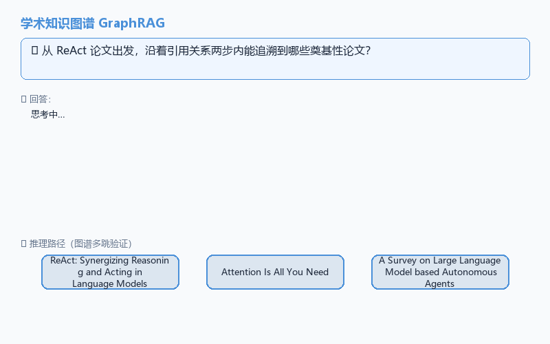
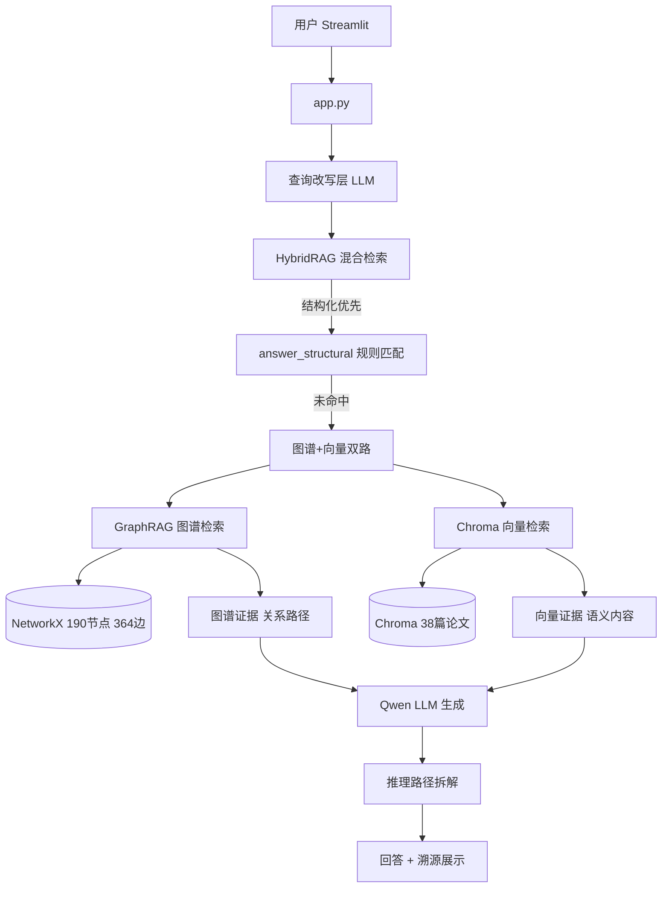

# 🎓 学术知识图谱问答系统（Scholar GraphRAG）

> 基于 **NetworkX 图谱 + Chroma 向量** 的混合 GraphRAG，解决纯向量检索答不了的"关系型多跳问题"。
> **技术栈**：NetworkX · Chroma · DashScope/Qwen · Streamlit · Neo4j（生产方案）



> 演示：两跳问题"从 ReAct 论文出发，沿着引用关系两步内能追溯到哪些奠基性论文？" → 答案 + 推理路径逐跳点亮

---

## ✨ 核心亮点

- 🔗 **图谱混合检索**：38 篇真实论文构建 190 节点 / 364 边知识图谱，结构化关系 + 语义内容双路召回
- 🦅 **多跳推理**：两跳/三跳引用链、共同引用汇聚分析——向量检索做不到的"关系型问题"
- 📈 **98.4% 命中率**：5 步消融优化（52.2% → 98.4%），每步有归因有数字，[OPTIMIZATION_LOG.md](eval/OPTIMIZATION_LOG.md) 完整记录
- 🔄 **查询改写层**：口语化问题（"Attention 那篇的作者还写过啥"）→ 实体+关系明确的检索友好形式
- 🔍 **答案溯源**：回答附带推理路径节点链，标注实体类型，可验证不黑箱
- 🧪 **错误三分类归因**：数据失败 / 生成失败 / 检索失败，对症下药不瞎调

---

## 🏗 架构



**核心设计**：结构化查询优先（直接命中图谱实体关系），未命中再走混合检索。图谱证据给"关系路径"，向量证据给"语义内容"，LLM 综合两类证据生成回答并输出推理路径。

---

## 📊 量化指标（实测）

### 命中率优化全过程

| 阶段 | 规模 | 平均命中率 | 全命中占比 |
|---|---|---|---|
| Baseline | 30 条抽样 | 52.2% | 40.0% |
| +检索 2 跳扩展 | 30 条抽样 | 58.3% | 40.0% |
| +严格 prompt | 30 条抽样 | 70.6% | 83.3% |
| +证据上限 40 | 30 条抽样 | 90.6% | 83.3% |
| 全量去偏后 | 100 条 | 88.2% | 86.0% |
| **+双向实体匹配** | **96 条** | **98.4%** | **96.9%** |

> 优化日志见 [eval/OPTIMIZATION_LOG.md](eval/OPTIMIZATION_LOG.md)，每步含改动点/效果/验证与教训。

### 混合检索对比

| 检索方式 | 命中率 | 说明 |
|---|---|---|
| 纯向量 | 44.4% | 语义相似≠关系正确 |
| 纯图谱 | 66.7% | 结构化查询强项 |
| 混合 | 66.7% | 下限由图谱托底 |

**诚实说明**：混合没反超图谱，因评测问题偏向结构化查询。图谱是混合的**稳定下限**——向量失效时托底。混合优势需语义性问题体现，见 [hybrid-analysis.md](docs/hybrid-analysis.md)。

### 多跳推理能力

6 个验证示例（[docs/multi-hop-examples.md](docs/multi-hop-examples.md)），含：
- 两跳：ReAct → CoT → Attention（间接关联）
- 三跳：Agent 综述 → ReAct → CoT → Attention（最长引用链）
- 共同引用汇聚：ReAct 和 RAG 共同引用 Attention（向量检索做不到）

---

## 🚀 快速开始

### 环境准备

```bash
conda activate ai-agent          # 项目运行环境（Python 3.11）
cd scholar_knowledge

# 配置 .env（项目根目录已有 .env，含 DashScope key）
# 也可参考 knowledge_agent/.env.example
```

### 构建图谱 + 启动界面

```bash
# 1. 采集论文数据（8 种子论文 → OpenAlex API 扩充到 38 篇）
python src/data_collector.py

# 2. 启动 Streamlit 界面
streamlit run app.py
```

界面打开后可：
- 输入问题对话（含查询改写 + 推理路径展示）
- 生成图谱可视化（节点类型颜色区分）

### 跑评测

```bash
# 全量评测（graph 模式，96 题）
python eval/run_eval.py --mode graph

# 错误归因分析
python eval/error_analysis.py

# 混合检索对比
python src/hybrid_rag.py
```

---

## 🛠 技术栈

| 层 | 技术 | 用途 |
|---|---|---|
| 图谱存储 | NetworkX MultiDiGraph | 190 节点 / 364 边，演示原型 |
| 向量检索 | Chroma + DashScope embedding | 38 篇论文语义检索 |
| LLM | DashScope Qwen | 查询改写 + 答案生成 |
| 界面 | Streamlit | 对话 + 图谱可视化 + 推理路径展示 |
| 评测 | 自研脚本 + RAGAS 口径 | 96 题命中率 + 错误三分类 |

---

## 📂 目录结构

```
scholar_knowledge/
├── app.py                      # Streamlit 界面（对话+图谱可视化+推理路径）
├── SPEC.md                     # 规格说明
├── src/
│   ├── data_collector.py       # 论文采集（种子 + OpenAlex API 扩充）
│   ├── graph_builder.py        # NetworkX 图谱构建（实体/关系/多跳查询）
│   ├── graph_rag.py            # 图谱检索（2跳扩展+双向实体匹配）
│   ├── hybrid_rag.py           # 混合检索（图谱+向量+查询改写+路径拆解）
│   └── query_rewriter.py       # 查询改写层（口语→规范，失败降级）
├── eval/
│   ├── run_eval.py             # 评测脚本（graph/vector/hybrid 三模式）
│   ├── build_eval_set.py       # 评测集生成 + 数据驱动去偏
│   ├── error_analysis.py       # 错误三分类归因（数据/生成/检索失败）
│   ├── OPTIMIZATION_LOG.md     # 优化日志（5步消融，面试调优方法论素材）
│   └── bad_cases.md            # Bad case 报告
├── data/
│   ├── scholar_data.json       # 38 篇论文数据
│   ├── eval_set.json           # 评测集（96 条，去偏后）
│   └── eval_report.json        # 评测结果
└── docs/
    ├── graph-design.md         # 图谱设计文档
    ├── eval-report.md          # 命中率优化报告
    ├── hybrid-analysis.md      # 混合检索对比分析
    ├── multi-hop-examples.md   # 6 个多跳问答示例
    └── graph-final.png         # 图谱可视化全貌
```

---

## 🏭 生产架构：迁移到 Neo4j

本项目使用 NetworkX 快速验证图谱价值。数据量增长到 10 万节点以上时，按以下方案迁移：

| 维度 | NetworkX（当前） | Neo4j（生产） |
|------|----------------|--------------|
| 存储 | 内存 | 磁盘 + 索引 |
| 查询 | Python 遍历 | Cypher 声明式查询 |
| 多跳性能 | O(n) 遍历，慢 | 索引加速，快 |
| 并发 | 单进程 | 服务化，支持多客户端 |

迁移映射（代码层面只改 `graph_builder.py` 的存储层）：

```cypher
-- 节点创建
CREATE (p:Paper {id: $id, title: $title, year: $year})
CREATE (a:Author {name: $name})

-- 关系创建
MATCH (p1:Paper {id: $id1}), (p2:Paper {id: $id2})
CREATE (p1)-[:CITES]->(p2)

-- 多跳查询（对应本项目 multi_hop 能力）
MATCH path = (p:Paper {title: "Attention Is All You Need"})-[:CITES*1..2]->(related)
RETURN related.title
```

Python 侧使用 `neo4j` 官方驱动：`GraphDatabase.driver(uri, auth=...)`，
将 `neighbors()` / `multi_hop()` 等方法替换为 Cypher 查询即可，上层检索逻辑无需改动。

---

## 🔮 未来工作

- **语义性评测扩充**：补充方法描述/论文对比类问题，让混合检索真正超越单项
- **Neo4j 迁移落地**：按生产架构方案替换存储层，验证 10 万节点性能
- **BM25 混合**：向量 + BM25 关键词检索，补充语义召回的精确匹配能力
- **论文数据扩容**：OpenAlex 采集到 200+ 篇，覆盖更多研究方向

---

## 📚 相关文档

- [评测优化报告](docs/eval-report.md) — 52.2% → 88.2% 四招优化详解
- [优化日志](eval/OPTIMIZATION_LOG.md) — 5 步消融记录，面试调优方法论
- [混合检索分析](docs/hybrid-analysis.md) — 为什么混合没超过图谱
- [多跳问答示例](docs/multi-hop-examples.md) — 6 个验证示例
- [图谱设计](docs/graph-design.md) — NetworkX 实体关系设计

---

*项目地址：[GitHub 仓库](https://github.com/)　|　技术栈：NetworkX · Chroma · Qwen · Streamlit*
